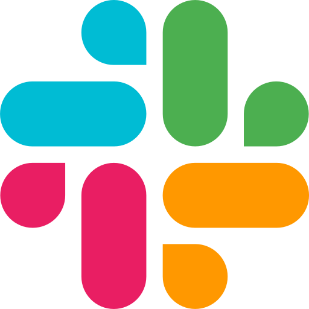

<h1 style="font-weight: 300; margin-top: 5px; margin-bottom: 0;">Slack Clone | <strong>ReactJS Challenge</strong></h1>
<h2 style="font-weight: 300;margin-top: 0px"><strong>Clever Programmer</strong></h2>

  	
	
	
	

<h2 style="font-weight:300">📹 Videos:</h2>

**[Day 1](https://www.youtube.com/watch?v=K07O0zh-eNc)** | **[Day 2](https://www.youtube.com/watch?v=ml_04VfhrNs)** | **[Day 3](https://www.youtube.com/watch?v=0RZDbsXLcRg)** | **[Day 4](https://www.youtube.com/watch?v=imdI8XgO-sE)** | **[Day 5](https://www.youtube.com/watch?v=eGSmujxNFMA)**

<h2 style="font-weight:300">🌐 Deploy:</h2>

<h2 style="font-weight:300">🚀 Commands:</h2>

-   `yarn start`: Runs the app in the development mode;
-   `yarn build`: To create a build to launch in production.

<h2 style="font-weight: 300">🗒 Changes:</h2>

-   Use **TypeScript**;
-   Use a different colors and create a **dark/light mode**;
-   Use folder to storage (to **Components** amnd **Controllers**) two files:
    -   `styles.tsx`: Contains styles using **Styled Components**;
    -   `index.tsx`: Contains the main code.
-   Create a channel info modal with delete function;

 

<h3 style="font-weight: 300">
🧑🏻‍💻 About Me
</h3>

<a href="https://github.com/TutoDS" alt="TutoDS">

 
 <b>Daniel Sousa @TutoDS</b>
</a>

[facebook]: https://facebook.com/tutods2014
[twitter]: https://twitter.com/tutods
[youtube]: https://youtube.com/tutods2014
[instagram]: https://instagram.com/dsousa_12
[linkedin]: https://www.linkedin.com/in/daniel-sousa-tutods/
[gitlab]: https://gitlab.com/jdaniel.asousa

[][facebook] [][twitter]

[][linkedin] [][instagram]

[][youtube] [][gitlab]

